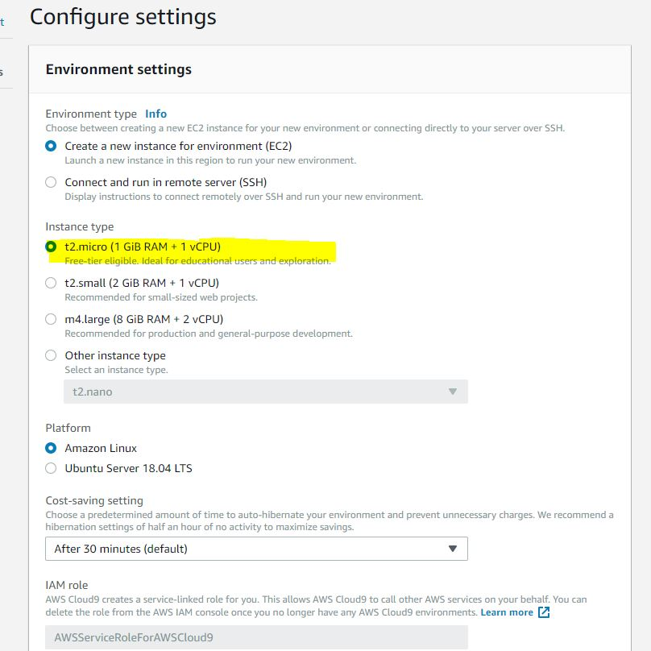

# Cómo acceder por primera vez a tu cuenta de AWS.
Debes acceder mediante este **enlace**
https://871103910546.signin.aws.amazon.com/console.
- Introduces tu usuario y contraseña que previamente te han proporcionado.
 >Debes contactar con chiara.broggi@everis.com
- La primera vez que accedes, estás obligado a cambiar la contraseña por una nueva.

Dentro de AWS:
 - Lo primero que debes hacer es marcar la opción **Irlanda**, de la pestaña **Region** que se encuentra en la parte superior derecha de la pantalla.
 - A continuación, debes crear tu entorno de **Cloud9**.
    > Se recomienda seguir la siguiente nomenclatura de usuario: **NOMBRE.PRIMER_APELLIDO** 
 - Por último, se muestra una foto de las opciones que debes tener marcadas en la instalación de Cloud9
 
> Se debe marcar la opción que aparece en la captura subrayada en **amarillo**, puesto que es **gratuita**.

# Cómo crear una cuenta de GITHUB.
1) Accedes a este enlace https://github.com
2) Creas un usario nuevo
    > Debes utilizar tu correo de everis (Ejemplo: correo_corto@everis.com).

3) Debes pedir al administrador que te proporcione permisos.

4) Pinchas en la opción **"clone or download"**.
5) Con el siguiente enlace, eliges **ssh**, mediante el cual se genera una clave que te permita poder entrar al repositorio sin tener que introducir tu usuario y contraseña cada vez que quieras acceder.
 > https://github.com/hycsteria/aws-training.git
 
6) Para configurar **ssh**, accedes a este enlace: https://help.github.com/en/articles/adding-a-new-ssh-key-to-your-github-account.
  > Debes introducir el texto obtenido a partir de ejecutar en la consola el siguiente comando: **cat ~/.ssh/id_rsa.pub**
  
7) Una vez configurado el ssh, puedes clonar el repositorio ejecutando el siguiente comando: **git clone git@github.com:hycsteria/aws-training.git**
  
 

